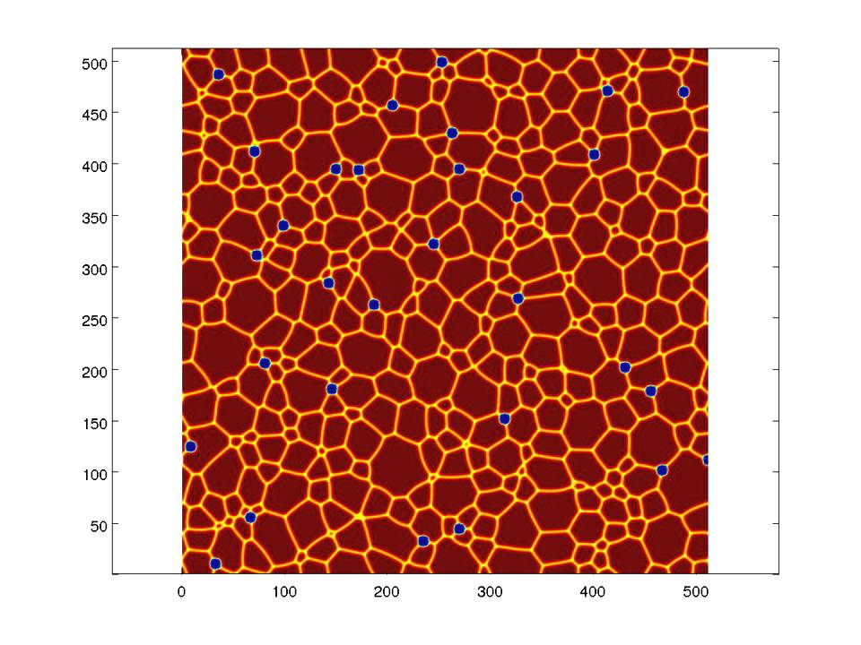
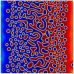
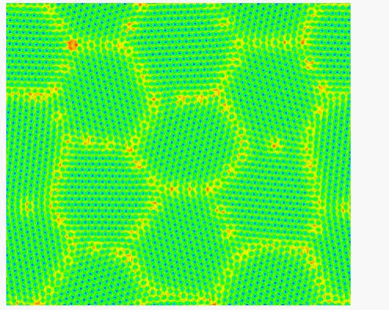

# PFHub: The Phase Field Community

## Connecting the Phase Field Community

:::{figure} images/PF.jpg
:width: 20%
:height: 10rem
:align: center
:::

<!--
%%html

    

        
    

    

        
    

    

        
    

-->

%%html

    

